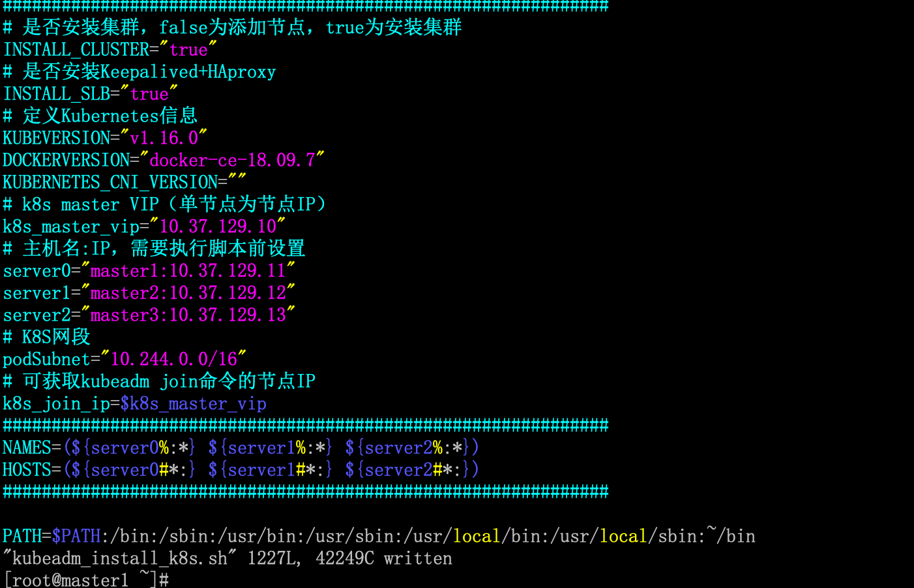
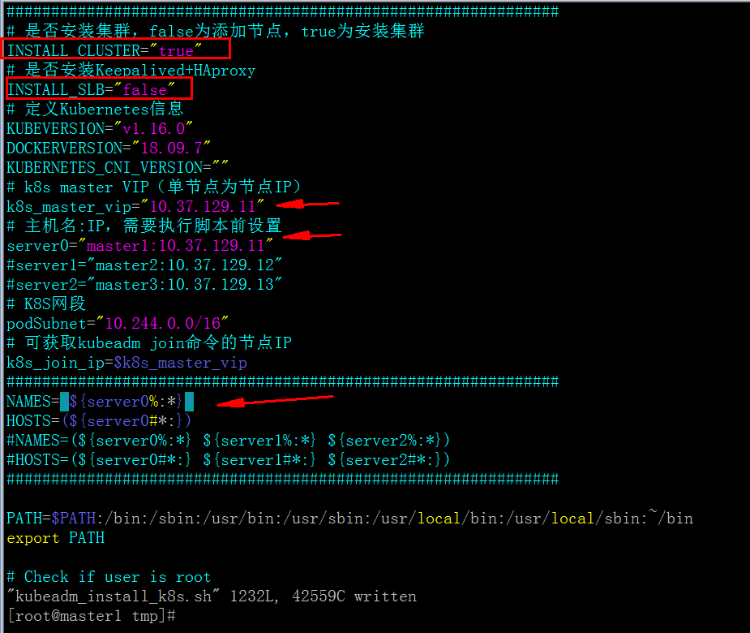
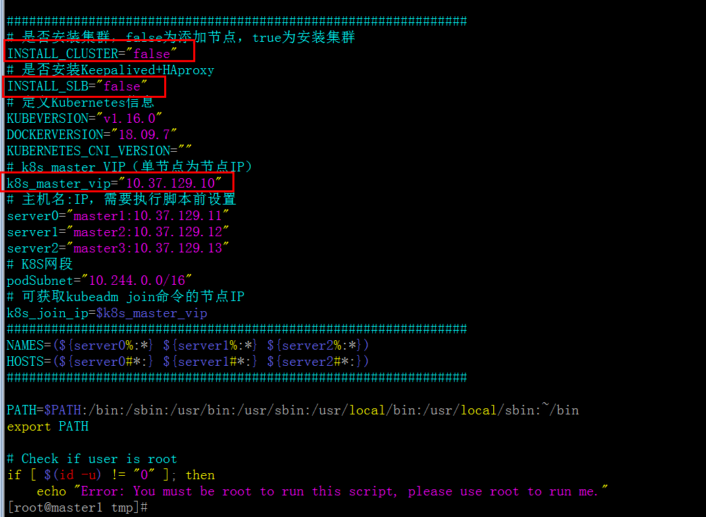

# 1. 介绍

仓库地址：[https://github.com/ygqygq2/kubeadm-shell](https://github.com/ygqygq2/kubeadm-shell)

脚本实现功能：
- [x] 新建多master节点（至少3台，奇数）的高可用kubernetes集群；
- [x]  新建单master节点的kubernetes；
- [x] 添加work节点；


# 2. 使用说明

## 2.1 高可用集群安装

提前关闭selinux（需要重启生效），master节点设置hostname，并添加hosts。


脚本修改，有需要添加更多master节点，添加`serverX`和修改`NAMES` `HOSTS`。


>**注意**：
>1. 在第一台master节点上执行此脚本；
>2. 脚本初始化时添加ssh key登录其它节点，可能需要用户按提示输入ssh密码；
>3. 脚本执行，需要注意脚本运行过程提示或报错；


执行成功。


## 2.2 单master kubernetes安装

提前关闭selinux（需要重启生效），master节点设置hostname，并添加hosts。



其它说明同上。

## 2.3 添加work节点至kubernetes集群

提前关闭selinux（需要重启生效），work节点设置hostname，并添加hosts（最好所有kubernetes节点统一相同hosts内容）。

关键地方设置，脚本使用ssh跳至master节点执行`kubeadm token create --print-join-command`获取添加节点命令，所以可修改`k8s_master_vip`或`k8s_join_ip`为能执行此命令的节点IP即可。

```bash
INSTALL_CLUSTER="false"
INSTALL_SLB="false"
k8s_master_vip="K8S-MASTER-CAN-SSH"
```



# 3. 失败的节点`kubeadm reset`
安装过程中，如有节点失败，可使用`kubeadm reset`重置后，重新安装。

>**注意**
>此命令非常危险，一定要确认是否在正确节点执行。


