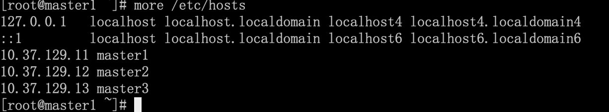
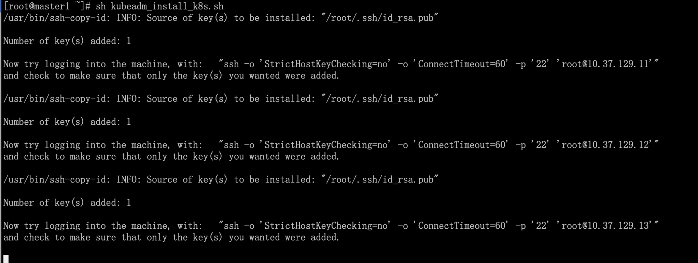
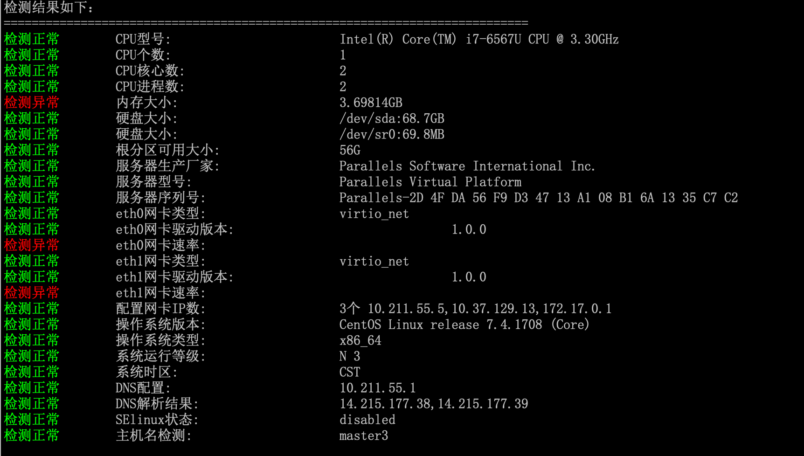
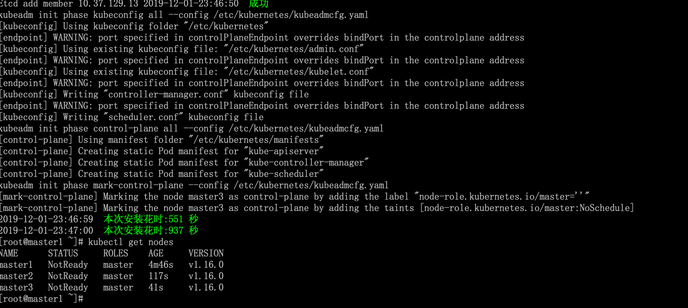
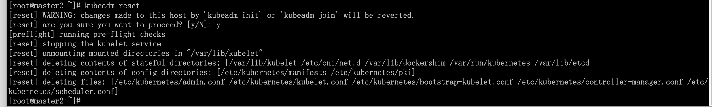

# 1. 介绍

仓库地址：[https://github.com/ygqygq2/kubeadm-shell](https://github.com/ygqygq2/kubeadm-shell)

脚本实现功能：
- [x] 新建多master节点（至少3台，奇数）的高可用kubernetes集群；
- [x] 新建单master节点的kubernetes；
- [x] 添加work节点；
- [x] 支持离线安装，前提是使用CentOS7的最小化安装准备安装包；

>离线安装说明
>1. 离线安装已支持 docker 安装 kubernetes； 
>2. 离线安装支持 containerd 安装 kubernetes（开发中）；
>3. 因 crio 没有镜像管理功能，不支持离线安装；


# 2. 使用说明
系统：CentOS7

>**重要**
>使用时请将整个仓库文件一起打包上传至服务器。

## 2.1 高可用集群安装

提前关闭selinux（需要重启生效），master节点设置hostname，并添加hosts。



`config.sh`脚本修改，有需要添加更多master节点，添加`serverX`和修改`NAMES` `HOSTS`。

```bash
##############################################################
## 集群安装和证书更新相关共同需要的参数设置
# 主机名:IP，需要执行脚本前设置
server0="master1:10.37.129.11"
server1="master2:10.37.129.12"
server2="master3:10.37.129.13"
##############################################################
## 集群安装相关参数设置
# 是否离线安装集群，true为离线安装
INSTALL_OFFLINE="false"
# 是否安装集群，false为添加节点，true为安装集群
INSTALL_CLUSTER="true"
# 是否安装Keepalived+HAproxy
INSTALL_SLB="true"
# 是否脚本生成CA证书
GENERATE_CA="false"
# 定义Kubernetes信息
KUBEVERSION="v1.17.0"
DOCKERVERSION="18.09.7"
KUBERNETES_CNI_VERSION=""
IMAGE_REPOSITORY="registry.cn-hangzhou.aliyuncs.com/google_containers"
# k8s master VIP（单节点为节点IP）
k8s_master_vip="10.37.129.10"
# K8S网段
podSubnet="10.244.0.0/16"
# 可获取kubeadm join命令的节点IP
k8s_join_ip=$k8s_master_vip
##############################################################
```

>**注意**：
>1. 在第一台master节点上执行此脚本；
>2. 脚本初始化时添加ssh key登录其它节点，可能需要用户按提示输入ssh密码；
>3. 脚本执行，需要注意脚本运行过程提示或报错；





执行成功。


## 2.2 单master kubernetes安装

提前关闭selinux（需要重启生效），master节点设置hostname，并添加hosts。`config.sh`配置：

```bash
##############################################################
## 集群安装和证书更新相关共同需要的参数设置
# 主机名:IP，需要执行脚本前设置
server0="master1:10.37.129.11"
#server1="master2:10.37.129.12"
#server2="master3:10.37.129.13"
##############################################################
## 集群安装相关参数设置
# 是否离线安装集群，true为离线安装
INSTALL_OFFLINE="false"
# 是否安装集群，false为添加节点，true为安装集群
INSTALL_CLUSTER="true"
# 是否安装Keepalived+HAproxy
INSTALL_SLB="false"
# 是否脚本生成CA证书
GENERATE_CA="false"
# 定义Kubernetes信息
KUBEVERSION="v1.17.0"
DOCKERVERSION="18.09.7"
KUBERNETES_CNI_VERSION=""
IMAGE_REPOSITORY="registry.cn-hangzhou.aliyuncs.com/google_containers"
# k8s master VIP（单节点为节点IP）
k8s_master_vip="10.37.129.11"
# K8S网段
podSubnet="10.244.0.0/16"
# 可获取kubeadm join命令的节点IP
k8s_join_ip=$k8s_master_vip
##############################################################
```

其它说明同上。

## 2.3 添加work节点至kubernetes集群

提前关闭selinux（需要重启生效），work节点设置hostname，并添加hosts（最好所有kubernetes节点统一相同hosts内容）。

关键地方设置，脚本使用ssh跳至master节点执行`kubeadm token create --print-join-command`获取添加节点命令，所以可修改`k8s_master_vip`或`k8s_join_ip`为能执行此命令的节点IP即可。

```bash
##############################################################
## 集群安装和证书更新相关共同需要的参数设置
# 主机名:IP，需要执行脚本前设置
server0="master1:10.37.129.11"
server1="master2:10.37.129.12"
server2="master3:10.37.129.13"
##############################################################
## 集群安装相关参数设置
# 是否离线安装集群，true为离线安装
INSTALL_OFFLINE="false"
# 是否安装集群，false为添加节点，true为安装集群
INSTALL_CLUSTER="false"
# 是否安装Keepalived+HAproxy
INSTALL_SLB="false"
# 是否脚本生成CA证书
GENERATE_CA="false"
# 定义Kubernetes信息
KUBEVERSION="v1.17.0"
DOCKERVERSION="18.09.7"
KUBERNETES_CNI_VERSION=""
IMAGE_REPOSITORY="registry.cn-hangzhou.aliyuncs.com/google_containers"
# k8s master VIP（单节点为节点IP）
k8s_master_vip="10.37.129.10"
# K8S网段
podSubnet="10.244.0.0/16"
# 可获取kubeadm join命令的节点IP
k8s_join_ip=$k8s_master_vip
##############################################################
```

## 2.4 离线安装
前提：在最小化的CentOS7下，能正常解析和上网。    

修改`config.sh`配置，`INSTALL_OFFLINE="true"`

```bash
# 是否离线安装集群，true为离线安装
INSTALL_OFFLINE="true"
```

执行脚本`k8s_offline_package.sh`，成功后整个`kubeadm-shell`目录即为一个离线安装包。
# 3. 失败的节点`kubeadm reset`
安装过程中，如有节点失败，可使用`kubeadm reset`重置后，重新安装。

>**注意**
>此命令非常危险，一定要确认是否在正确节点执行。


